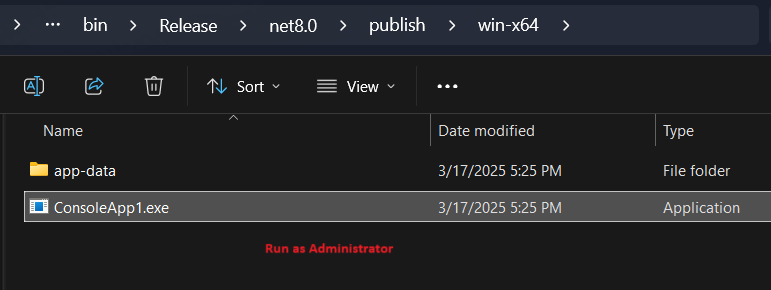
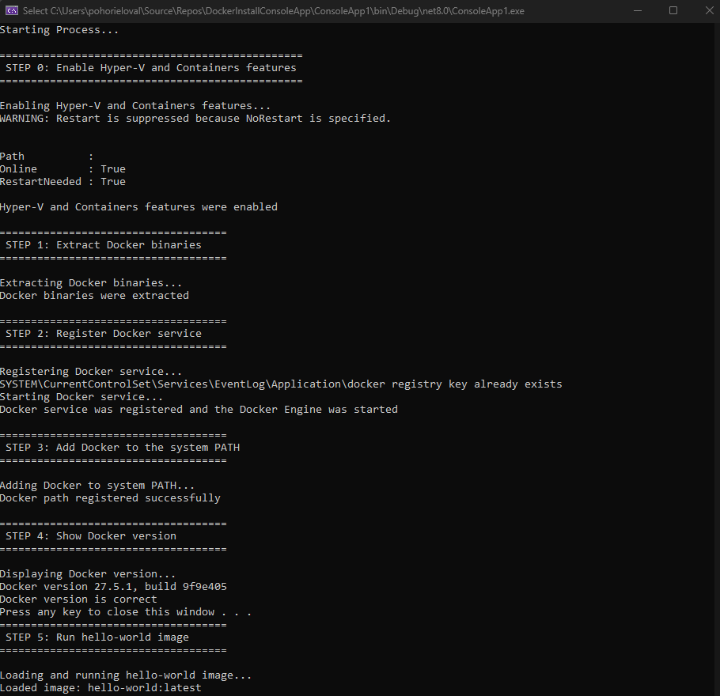
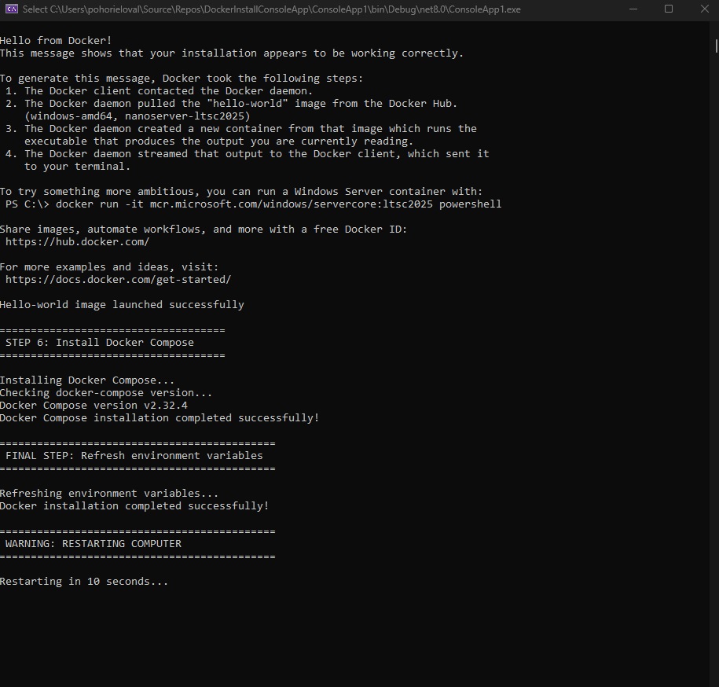

# Docker Installation Console Application
This repository contains scripts and other files required for creating an executable application for Docker installation.

## Documentation
Full documentation can be found at [Docker Offline - Docker Installation](https://reedelsevier-my.sharepoint.com/:w:/r/personal/osypovay_science_regn_net/Documents/Documents/Elsevier/JPOC/Docker%20offline/Docker%20Offline.docx?d=wb2b34869ca2a4b4f83e389fbb32a95df&csf=1&web=1&e=QlAW26&nav=eyJoIjoiMTE2NDQ0MzkzMSJ9).

## Visual Demo
### Basic User Scenario
1. User recieves **.zip arhieve** with the application.
2. User extracts the arhieve.
3. User runs the application **as Administartor**.
4. Application installs Docker and automatically **restarts the user's machine**.
5. Machine is ready for Docker usage.

### Screenshots

